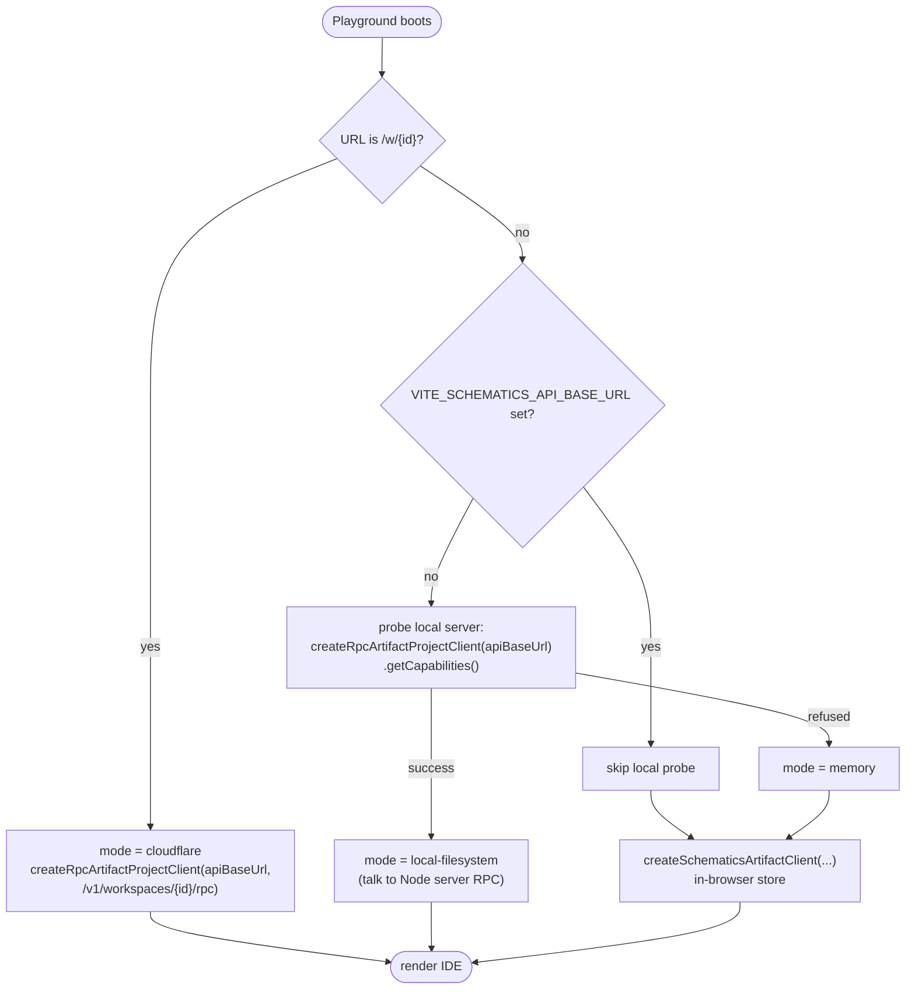
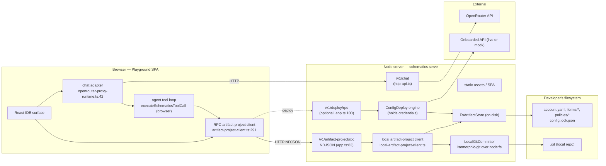
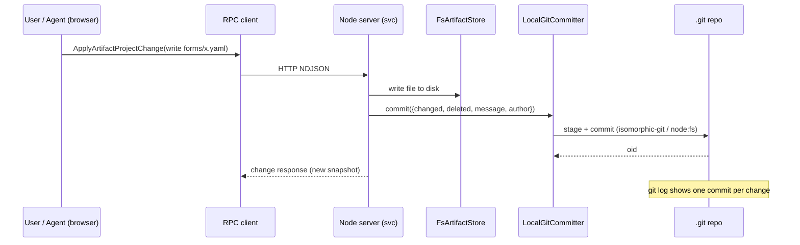
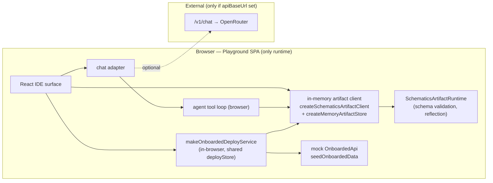
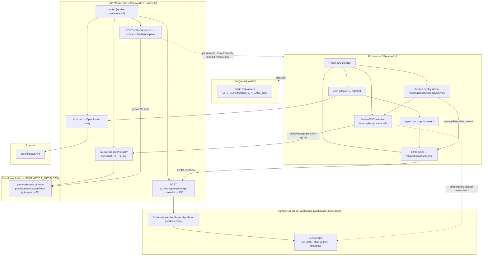
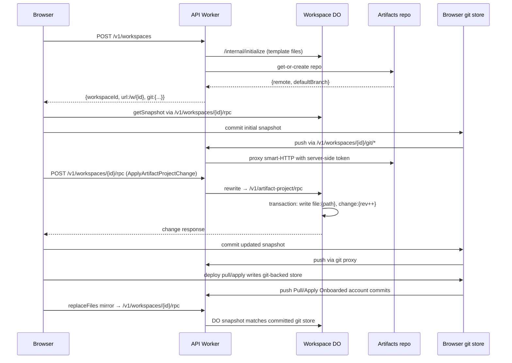
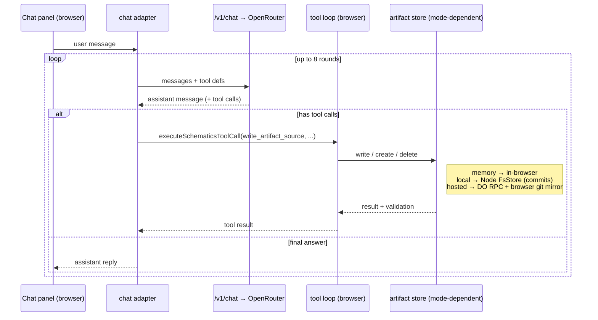
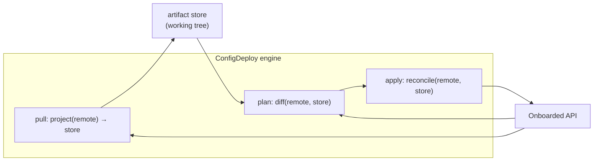
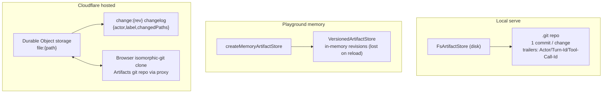

# Architecture: deployment modes & data flow

How Schematics actually runs, end to end, in each of its three modes — and where
the data and services live in each. This is the map that
[plan-onboarded-config-e2e-demo.md](./plan-onboarded-config-e2e-demo.md) builds
on; read that for the _demo_ story, read this for the _topology_.

All file:line references are anchors into the current tree, not contracts.

## The three modes at a glance

|                 | **Local serve**                             | **Playground (memory)**               | **Cloudflare hosted**                                          |
| --------------- | ------------------------------------------- | ------------------------------------- | -------------------------------------------------------------- |
| Entry           | `schematics serve <dir>`                    | static SPA, no server                 | API worker + Playground worker                                 |
| Artifact store  | `FsArtifactStore` on disk                   | `createMemoryArtifactStore` (browser) | Durable Object storage mirrored to browser git                 |
| Store mode      | `local-filesystem`                          | `memory`                              | `remote`                                                       |
| Where edits run | Node server, RPC                            | in-browser                            | Durable Object RPC, then browser-side git commit/push          |
| Agent tool loop | **browser**, writes via RPC                 | **browser**, writes in-memory         | **browser**, writes via RPC                                    |
| Chat/LLM        | `/v1/chat` → OpenRouter                     | `/v1/chat` → OpenRouter               | `/v1/chat` → OpenRouter (shared worker)                        |
| Deploy engine   | optional `/v1/deploy/rpc` (server-side)     | in-browser, mock API                  | in-browser hosted demo against mock API, backed by browser git |
| Git / history   | local git repo (node `fs`), `history: true` | none                                  | browser git clone pushed through worker proxy, `history: true` |
| Provenance      | one commit per change                       | in-memory revisions                   | browser git trailers for hosted edits/deploys                  |

The constant across all three: the **same** `SchematicsArtifactProjectRpcGroup`
contract (`protocol/src/artifact-project.ts:260`) and the **same** browser-side
agent tool loop. Only the store implementation and where it lives change.

---

## Mode selection — how the playground picks a backend

The playground SPA probes at startup (`apps/playground/src/main.tsx:40-184`):

Three terminal states → three modes. The same React surface renders all three;
it just receives a different artifact-project client.

---

## Mode A — Local `schematics serve <dir>`

A Node HTTP server (`packages/server/src/node.ts:28`, default port ~4317/4318)
serves both the RPC API and the static SPA. The store is the developer's
directory; if that directory is a git repo, every change is committed.

Key facts:

- **Agent runs in the browser.** The chat adapter calls `/v1/chat` (a thin
  OpenRouter proxy), then executes tool calls _locally in the browser_. Tool
  writes go back over the artifact-project RPC, so they hit the Node store and
  get committed — the agent never touches the server store directly.
- **`history` is on** because `gitCommitter !== null`
  (`cli/src/local-artifact-project-client.ts`). Each `ApplyArtifactProjectChange`
  becomes one git commit with the change label as the message.
- **Deploy runs server-side** when the deploy RPC is wired: the engine holds the
  credentials and the working-tree store, and the browser just drives
  pull/plan/apply over `/v1/deploy/rpc`.

### Local change → commit (sequence)

---

## Mode B — Playground (in-browser memory)

No server. The SPA constructs an in-memory store and runs everything client-side.
Used for examples and the in-browser deploy demo.

Key facts:

- **Everything is in the browser**, including the deploy engine — `pull/plan/apply`
  run against the in-memory mock Onboarded API (`mock/seed.ts`), writing into the
  _same_ `deployStore` the IDE renders, so Pull visibly fills the file tree
  (commits 89f4e6c / 808d6cf).
- **No git, no persistence.** History is the in-memory `VersionedArtifactStore`
  revisions; a reload loses everything. This is exactly the ephemerality the
  e2e-demo plan replaces with git.
- Chat still needs a `/v1/chat` endpoint somewhere (the playground worker or a
  local server) unless the example is non-agentic.

---

## Mode C — Cloudflare hosted

Two workers. The **Playground worker** serves the SPA; the **API worker** owns
workspace creation, per-workspace Durable Objects, chat, and git-repo
provisioning/proxying. Each workspace is one Durable Object instance with its
own storage, plus a per-workspace Artifacts git repo when the
`SCHEMATICS_ARTIFACTS` binding is configured.

Key facts:

- **The DO remains the RPC source of truth for hosted workspace files.** Files
  live as `file:<path>` keys; each `applyChange` runs in a storage transaction,
  bumps a revision, and writes a `change:<rev>` changelog entry with
  `{actor, label, changedPaths}` (`workspace-object.ts:193`).
- **Git is the hosted history/provenance mirror used by the playground.**
  `createHostedWorkspace` calls `provisionWorkspaceRepo` best-effort and returns
  a proxied smart-HTTP remote (`/v1/workspaces/:id/git`). The browser clones or
  initializes that repo in `mem-fs`, commits the initial DO snapshot, pushes user
  edits and deploy pull/apply commits, and serves History from the browser-side
  git clone.
- **Tokens do not reach the browser.** The worker proxy forwards smart-HTTP bytes
  to the Artifacts remote and injects short-lived Artifacts credentials
  server-side.
- **The worker can't run git** (`isomorphic-git`/`crc-32` won't bundle), which is
  why clone/fetch/stage/commit/push happen browser-side through the worker proxy.
- **Per-stage isolation:** the Artifacts namespace is stage-scoped
  (`…-pr-20`, `…-prod`), so preview/staging/prod workspaces never collide
  (`packages/cloudflare/src/alchemy.ts`).
- **No server-side deploy RPC is exposed in hosted mode.** The playground's
  hosted Onboarded demo runs the mock deploy service in the browser against the
  same browser git store, then mirrors committed snapshots back to the DO.

### Hosted: create → edit / deploy (sequence)

---

## Cross-cutting: the agent tool loop (identical in all modes)

The agent is **not** a server-side loop. The browser drives it; only the LLM
call and the store write cross a boundary, and _where_ the store write lands is
the only thing that differs per mode.

This is why provenance threading matters in the demo plan: the tool loop knows
the turn/tool-call IDs. They become commit trailers in local mode, and hosted
browser commits preserve the same trailer shape when the hosted chat/tool path
applies an agent change. Memory mode remains in-memory revision metadata only.

---

## Cross-cutting: the deploy engine (pull / plan / apply)

The deploy engine (`config-deploy/src/engine.ts`) is the same in every mode; what
changes is _where it runs_ and _which Onboarded API it talks to_.

- **Local serve:** engine runs **server-side** behind `/v1/deploy/rpc`, holding
  real credentials in a `DeploySecretStore`; the browser only drives it. Talks to
  the live Onboarded HTTP API (or mock).
- **Playground memory:** engine runs **in-browser** against the **mock** API and
  the shared in-memory store — the self-contained demo.
- **Cloudflare hosted:** the playground demo runs **in-browser** against the
  **mock** API, but the store is the hosted browser git store. Pull/apply commits
  are pushed through the worker git proxy and then mirrored back to the hosted
  DO with `replaceFiles`. A production hosted deploy would move credentials and
  the deploy engine server-side.

The `pull ⇄ apply` arrows back to `remote` are the convergence loop formalized in
the e2e-demo plan: a clean working tree makes `pull ∘ apply` identity, which is
why "merge a draft" and "re-pull the account" reach the same fixed point.

---

## Storage & history substrate — side by side

The throughline of the e2e-demo plan: **collapse these three substrates onto
git** (`GitArtifactStore`, `git-artifacts/src/git-artifact-store.ts`) so history,
provenance, fork, and merge work identically regardless of where the store
physically lives.

---

## See also

- [plan-onboarded-config-e2e-demo.md](./plan-onboarded-config-e2e-demo.md) — the
  demo this topology supports, and the three seams that close the gaps above.
- [git-artifacts-demo.md](./git-artifacts-demo.md) — local vs Cloudflare git
  store runbook.
- [plan-git-artifacts.md](./plan-git-artifacts.md) — the three-layer git store
  (provider · backend · store).
- [plan-config-deploy-ui.md](./plan-config-deploy-ui.md) — the pull/plan/apply UI.
